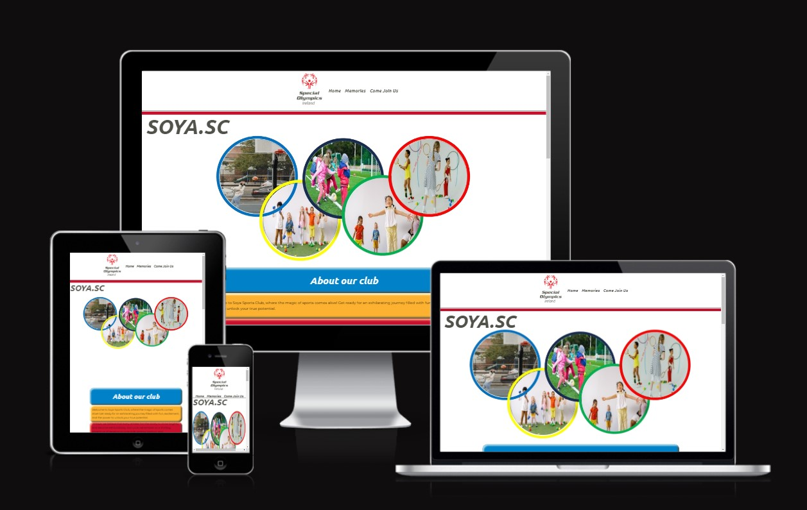
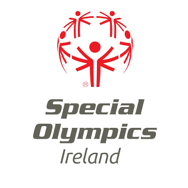
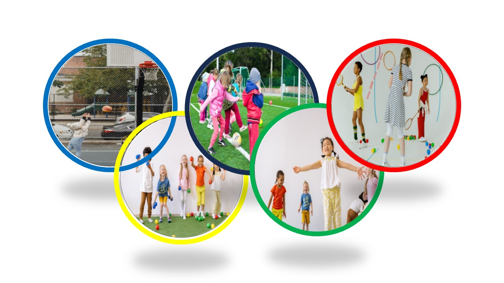
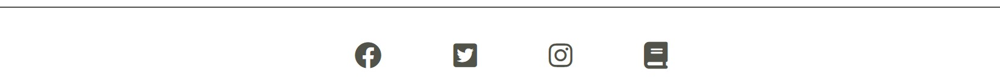
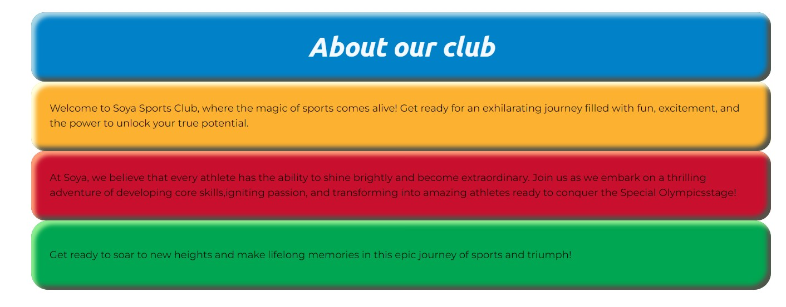
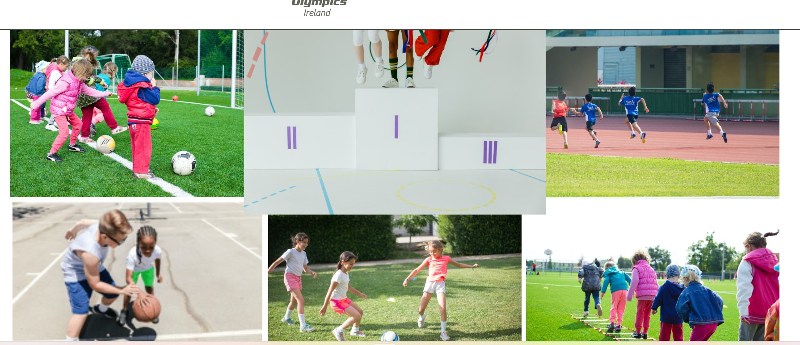
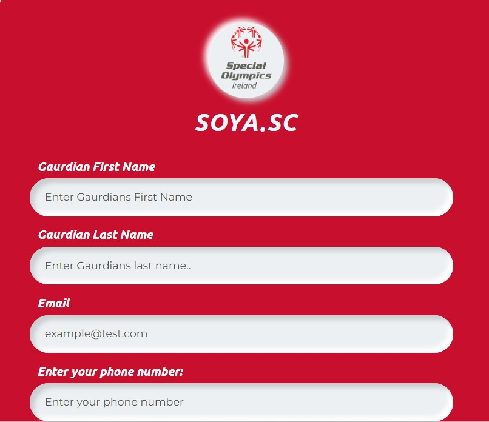
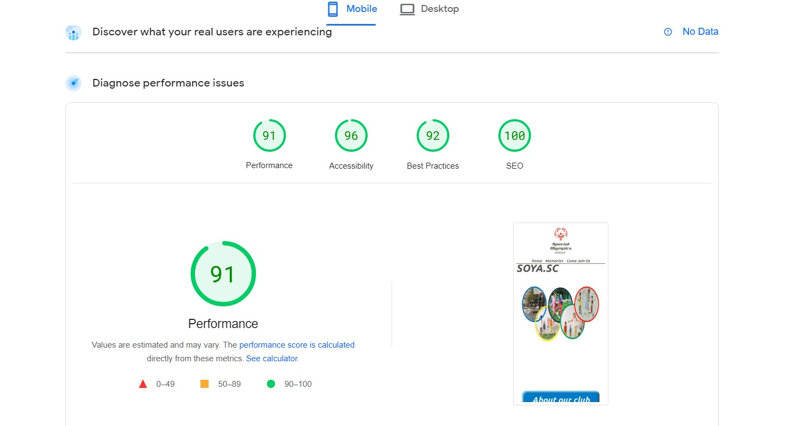
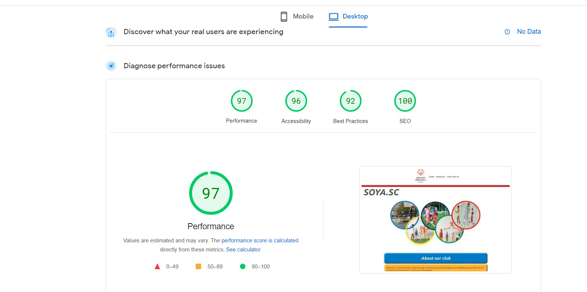

# **SOYA.SC**
## **About this site**
Special Olympics Young Athletes Galway is a sports club in Galway City. It aims to develop young athletes skills through play and fun. It teaches young kids the fundamental development skills needed promote the futures greatest athletes. This is achieved through play with a focus on throwing, kicking, athletics, free play and much more.  

)
## Table of contents:
1. [**About this site**](#about-this-site)
1. [**Planning stage**](#planning-stage)
    * [***Target Audiences***](#target-audiences)
    * [***User Stories***](#user-stories)
    * [***How this will be achieved***](#how-is-this-will-be-achieved)
    * [***How Is This Will Be Achieved:***](#how-is-this-will-be-achieved)
    * [***Color Scheme***](#color-scheme)
1. [**Current Features Common to all pages**](#current-features-common-to-all-pages)
    * [***Header***](#header)
    * [***Logo***](#logo)
    * [***Hero Img***](#hero-image)
    * [***About Page***](#about-page)
    * [***Memories Page***](#memories-page)
    * [***Sign up Page***](#sign-up-page)
    * [***Anchor Tags***](#anchor-tags)
    * [***Footer***](#footer)
    * [***Typography***](#typography)
1. [**Individual Content**](#current-features-common-to-all-pages)
    * [***About***](#about-page)
    * [***Memories***](#memories-page)
    * [***Sign Up***](#sign-up-page)
1. [**Future-Enhancements**](#future-enhancements)
1. [**Deployment**](#deployment)
1. [**Credits**](#credits)
    * [**Honorable mentions**](#honorable-mentions)
    * [**Content**](#content)

## **Planning stage**

### **Target Audiences:**
* Users who have never heard of special olympics young atheles sports club Galway
* Users who wish to find upcoming training events. 
* Users who want to view previous club events and upcoming events. 
* Users who have heard about the Special Olympics Young athletes sports club and would like to find out more and or sign up. 

### **User Stories:**
* As a user, I want to able to register and sign up. 
* As a user, I want to able to view classes and programs.
* As a user, I want to be able to access important information and trainings easily regarding the club. 
* As a user, I was to be able to easily naviagate my way through the page(s).
* As a user, I want easy access to discussions and announcements. 

### **Site Aims:**
* To gather all the trainings associated to SOYA and make them more accessable by the parents, volunteers etc.
* To assist in the rebranding of SOYA from a charity to a sports club.
* To offer users another form of media to connect with similar people.
* To provide a space where users can learn about upcoming programes, shecdules and events. 
* To prodide the club with another safe and secure means to sign up, register and store atheles data.
* To provide a fun area where memories can be stored for life. 

### **How Is This Will Be Achieved:**
* The home page provides the user with an introduction to the Special Olympics Young Athletes Sports Club. A breif history of the club and what they wish to achieve. 
* The site will provide a Gallery where the club can share its memories. 
* The site will provide sign up / register page where parents can sign their atheletes up. 
* The site will provide a training page, this will link in all relevent trainings members need to have completed. 
* The site will provide all relevent communications / information on programes running. 
* The site will provide links to the clubs social media sites. 
* The site will provide an for additional/more informtion link with will direct the user back to spcial olympics ireland.  

### **Color Scheme:**
When deciding the color scheme, I had a few ideas I wanted to play around with. I wanted to use the special olympics grey and red, as used in their logo. I also decided I wanted to incorporate the colors of the Olympic Rings. This is a site for young athletes. I thought this mix of colours would be it bright and child friendly. 

## **Current Features Common to all pages**
###  **Header**
)

For the header, I decided to incorporate the Special Olypics Logo with a Nav bar. I wanted to keep it clean and free from clutter. I designed a header element to float and remain seen at the top of the page. I personally always like to be able to see the top of page. I thought it worked well so I kept it. I originally did not have this set to stick, it look just off when I was scolling. It is centered and adjusts to all screen sizes, remaining the same. It also links to an additional 2 pages. 

#### *Logo:*
* The logo brings a sporty offical vibe to the page.
)

### **Hero Image**
* I have included one hero image on the main page. It is designed using the olympics ring, with an image in each ring.

### **About Page**:
The hero image depicts the athletes in the olypic rings. I thought it might be a cool feature and way to show of the athletes and introduce a colour theme. The about page also provides a small summary about what we try to achieve at SOYA. It then breaks down some of the key skills areas and finishes off with a calander of up comming classes, dates, times and more details.
)

### **memories page**:
I wanted to add a gallery style page, where atheletes developments can be shared. 

### **Sign up page:**
A Simple page where new athletes can be signed up. 

## **Anchor Tags**
* All anchor tags in areas where it would not seem obvious to a user, the underline has been left in to let the user know, this is clickable. 

## **Footer**
* The footer includes direct links to all the clubs socials, trainings and memberships. 

* These icons were imported from font awesome using Javascript at the bottom of the page. I followed the same method from the love running project. 

## **Typography**
* Throughout the page, there are two fonts used:
  * Upbuntu - For all titles and headings. 
  * Montserrat - For all other text. 

## **Individual Page Content features**
### **About This Site:**

* This page gives a brief introduction to SOYA. It explains some of the core trainings and developements our Athletes develop through play. it contains the hero img, unique to this pg only. 

)

### **Memories Page:**
* This page includes a small gallery, it is to demonstrate how the memories of our athelets developments can be shared. 

### **Sign up Page**

* This page allows the user (gaurdian) to sign up their young athelete. 

*Note: This form doesn't gather any data; it was created using an action request. It's only purpose is show that the submit button works. 

()

## **Future-Enhancements**
I think in the future I would like to revist this site and turn into something great. I think with some more time spent in planning, a better understanding of CSS and responsive design, thrown in with some Java Script, I think this site could really serve a purpose. 

## **Deployment**
* I deployed the page on GitHub pages, the live site can be found at the following URL - [SOYA.SC live webpage](https://addieog.github.io/Project-One-SOYA/)
* tested performance messaure mobile
* tested performance messaure desktop
* tested validation at 

## **Credits**
### **Honorable mentions**
This project could not have happened without the support of the following people listed in no particular order:

* [David Bowers](https://github.com/dnlbowers) - an absolute gent and a scholar. There is no way I could have gotten through this project without his guidence!  

### **General reference:**
* The project was influenced by the Code Institutes code along project called Love running. Whilst I have tried to deviate as much as possible there may be some similarities in the code.
* I relied upon W3schools, MDN web docs youtube videos for general references throughout the project.
* performance messaure mobile
* performance messaure desktop)

### **Content:**
* All content was written by myself. 
* Icons in the footer were taken from [Font Awesome](https://fontawesome.com)
* The Logo was taken from - [Speical Olympics Branding](https://media.specialolympics.org/resources/brand-awareness-and-communication/branding/brand-guidelines/Brand-Guidelines-for-Accredited-Programs.pdf).
* All fonts imported from - [Google Fonts](https://fonts.google.com/)
* Accessibility checker - [Google Dev](https://pagespeed.web.dev/)
* Image in the hero image 1[pexels.com](https://www.pexels.com/photo/unrecognizable-girl-playing-basketball-on-sports-ground-5623073/)
* Image in the hero image 2[pexels.com](https://www.pexels.com/photo/toddler-playing-soccer-296302/)
* Image in the hero image 3[pexels.com](https://www.pexels.com/photo/girls-having-fun-while-holding-tennis-rackets-9648765//)
* Image in the hero image 4[pexels.com](https://www.pexels.com/photo/little-girls-and-boys-having-fun-playing-with-colorful-balls-8613146/)
* Image in the hero image 5[pexels.com](https://www.pexels.com/photo/children-playing-with-colorful-mats-8613318//)
* Image within in gallery - [pexels](https://www.pexels.com/photo/four-boys-running-in-track-2310482/)
* Image within in gallery - [pexels](https://www.pexels.com/photo/children-s-team-building-on-green-grassland-296301/)
* Image within in gallery - [pexels](https://www.pexels.com/photo/children-playing-football-together-8813539/)
* Image within in gallery - [pexels](https://www.pexels.com/photo/green-tennis-ball-on-court-1405355/)
* Image within in gallery - [pexels](https://www.pexels.com/photo/kids-playing-basketball-8336977/)
* Image within in gallery - [pexels](https://www.pexels.com/photo/kids-standing-on-a-podium-9654731/)
* Image within in gallery - [pexels](https://www.pexels.com/photo/girls-taking-a-break-from-tennis-8223988/)
* Image within in gallery - [pexels](https://www.pexels.com/photo/low-angle-photo-of-a-boy-playing-soccer-2682543/)
* Image within in gallery - [pexels]()
* Images editing was done using - [canva](https://www.canva.com/) 
* Inspiration for the sign up page - [@Prathkum](https://codepen.io/prathkum/pen/OJRvVzY) 
* site used for performance - [google devs](https://pagespeed.web.dev/analysis/https-addieog-github-io-Project-One-SOYA/8rnnyexy1f?form_factor=mobile) 

